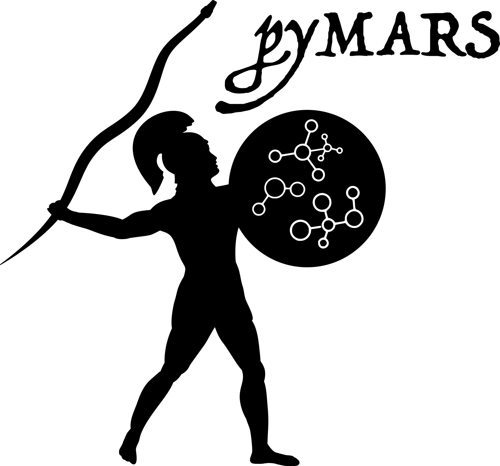

# pyMARS

Python-based (chemical kinetic) Model Automatic Reduction Software (pyMARS) implements multiple techniques for reducing the size and complexity of detailed chemical kinetic models.

An installation guide, usage examples, theory details, and API docs are provided in the online documentation: https://Niemeyer-Research-Group.github.io/pyMARS/

pyMARS currently consists of four methods for model reduction:

 1. Directed relation graph (DRG)
 2. Directed relation graph with error propagation (DRGEP)
 3. Path flux analysis (PFA)
 4. Sensitivity analysis (SA)

Sensitivity analysis may be run following one of the first three methods, or directly on the starting
model; however, its computational expense is high, and applying this method alone is not recommended.

## Installation

pyMARS requires Python 3.10+ and [Cantera](https://cantera.org) 3.x.

We recommend installing pyMARS into an isolated environment (e.g., a `venv` or a
conda environment) rather than your system or base Python. See the
[installation guide](https://Niemeyer-Research-Group.github.io/pyMARS/installation.html)
for details.

**Via pip (PyPI, recommended):**

    pip install nrg-pymars

**Via conda (`conda-forge`):**

    conda install -c conda-forge nrg-pymars

**From GitHub (latest development version):**

    pip install git+https://github.com/Niemeyer-Research-Group/pyMARS.git

**From a cloned repository:**

    git clone https://github.com/Niemeyer-Research-Group/pyMARS.git
    cd pyMARS
    pip install .

> **Note:** On PyPI and conda-forge, pyMARS is distributed under the name `nrg-pymars`, because
> the `pymars` name belongs to an unrelated, active project. The import package
> and command-line tool remain `pymars` — install with `pip install nrg-pymars`,
> then `import pymars` or run `pymars`.

## Usage

For detailed usage examples, see the [online documentation](https://Niemeyer-Research-Group.github.io/pyMARS/).
Once installed, the list of options can be found with:

    pymars --help

pyMARS requires models in the Cantera format. However, running pyMARS with a CHEMKIN file will convert it
into a Cantera file. pyMARS also provides the `--convert` option to convert a given model to/from
the CHEMKIN format.

## Citation

Please refer to the CITATION file for information about citing pyMARS when used in a scholarly work.

If you use this package as part of a scholarly publication, please consider citing the appropriate
theory/method papers in addition to the software itself.

## License

pyMARS is released under the MIT license; see LICENSE for details.

## Code of Conduct

To ensure an open and welcoming community, pyMARS adheres to a code of conduct adapted from the [Contributor Covenant](http://contributor-covenant.org) code of conduct.

Please adhere to this code of conduct in any interactions you have in the pyMARS community. It is strictly enforced on all official PyKED repositories, websites, and resources. If you encounter someone violating these terms, please let the project lead (@kyleniemeyer) know via email at <kyleniemeyer@fastmail.com> and we will address it as soon as possible.
